# Propositum-Fungorum
Интеллектуальная система, позволяющая проводить опрос, связанный с выбором хирургического лечения, на основе графовой модели принятия решений. Сами графы знаний извлекаются автоматически посредством использования LLM и имплементирования метода каскадных промптов.

## Установка и сборка
1. Необходимо склонировать репозиторий
```sh
# SSH
git clone git@github.com:nibbartemka/Propositum-Fungorum.git
# HTTPS
git clone https://github.com/nibbartemka/Propositum-Fungorum.git
```

2. Перейти в директорию проекта
```sh
cd ./Propositum-Fungorum
```

3. В корне проекта сформировать `.env` файл на основе `.env.example` 
```sh
cp .env.example .env
```

4. Подставить необходимые значения в ранее описанные `.env` вместо `***`
```sh
# Например
# MinIO root credentials (только для инициализации)
MINIO_ROOT_USER=***
MINIO_ROOT_PASSWORD=***
MINIO_BROWSER_REDIRECT_URL=***
MINIO_ALIAS=***
MINIO_ENDPOINT=***

BUCKET_0=***
BUCKET_PUBLIC_0=***
BUCKET_VERSIONING_0=***

MINIO_APP_USER=***
MINIO_APP_PASSWORD=***
MINIO_APP_ENDPOINT=***
MINIO_APP_BUCKET_NAME=***

LLM_TEMPERATURE=***
LLM_MAX_TOKENS=***
LLM_PARALLEL_TASK_MODE=***

SERVICE_NAME=***
SERVICE_ENV=***

YANDEX_API_URL=***
YANDEX_AUTH_TOKEN=***
YANDEX_MODEL_PACKAGE=***

BACKEND_HOST=***
BACKEND_UPLOAD_PATH=***
BACKEND_DOWNLOAD_PATH=***
BACKEND_METADATA_PATH=***
BACKEND_RELOAD_PATH=***
```

Убедитесь, что у вас установлен и запущен Docker
```sh
# Ссылка на скачивание Docker
https://www.docker.com/products/docker-desktop/
```
5. Находясь в корневой директории необходимо развернуть проект:
```sh
docker compose up -d --build
```

* Проект будет доступен на http://localhost/

* Загрузка своих клинических рекомендаций будет доступна на http://localhost/api/parser/docs

## 

## Руководство пользователя

1. Открыть http://localhost/

При открытии приложения пользователь попадает на главную страницу, в рамках которой он может выбрать клиническую рекомендацию (рисунок 1).

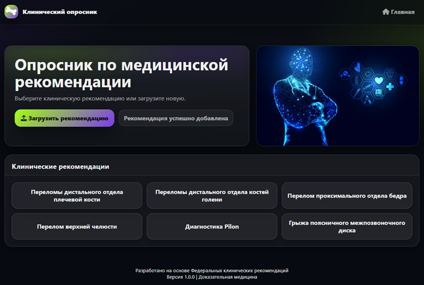

_Рисунок 1 – Главная страница системы_

Далее путь пользователя будет описан на основе клинической рекомендации «Перелом проксимального отдела бедра».


_Рисунок 2 – Страница опросника_

Сам процесс опроса представлен на рисунке 3.

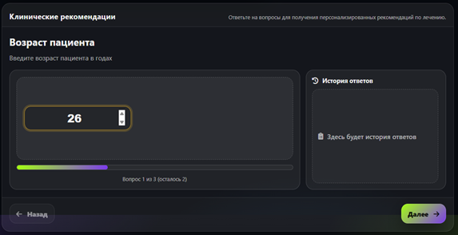

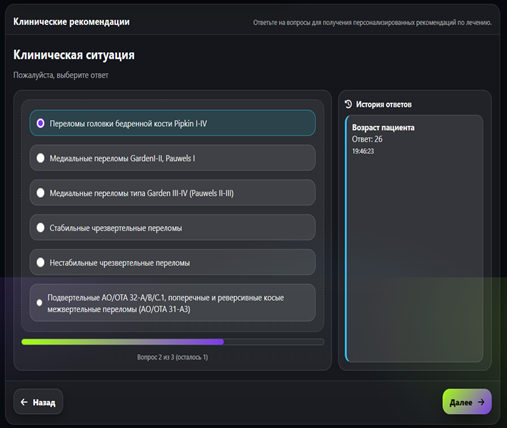

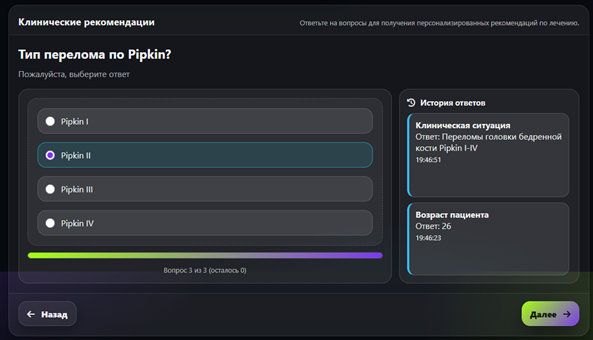

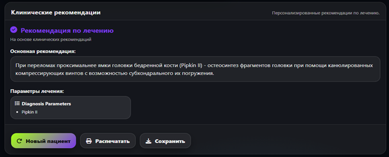

_Рисунок 3 – Процесс проведения опроса_

Для просмотра самого графа пользователю необходимо выбрать пункт «Схема алгоритма» (рисунок 4).


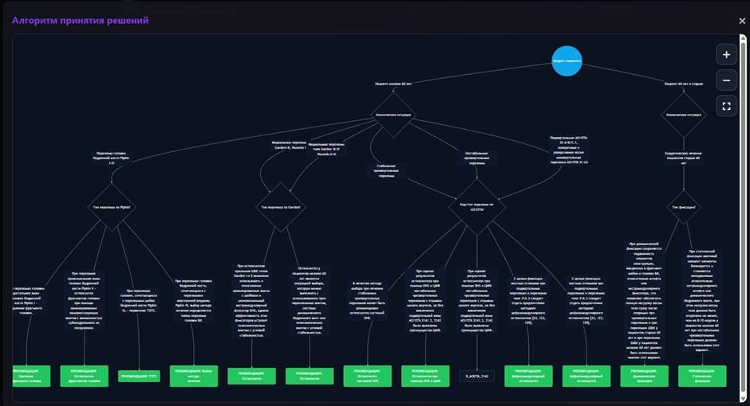

_Рисунок 4 – Схема алгоритма опроса_

Для просмотра качества сгенерированной онтологии на основе заранее заданной структуры пользователю необходимо перейти к пункту «Метрики качества» (рисунок 5).

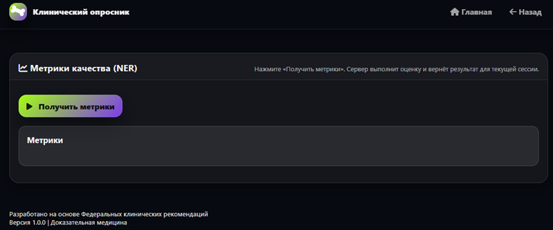

_Рисунок 5 – Схема алгоритма опроса_

При нажатии на кнопку «Получить метрики» будет совершена повторная обработка загруженного документа данной клинической рекомендации (рисунок 6).

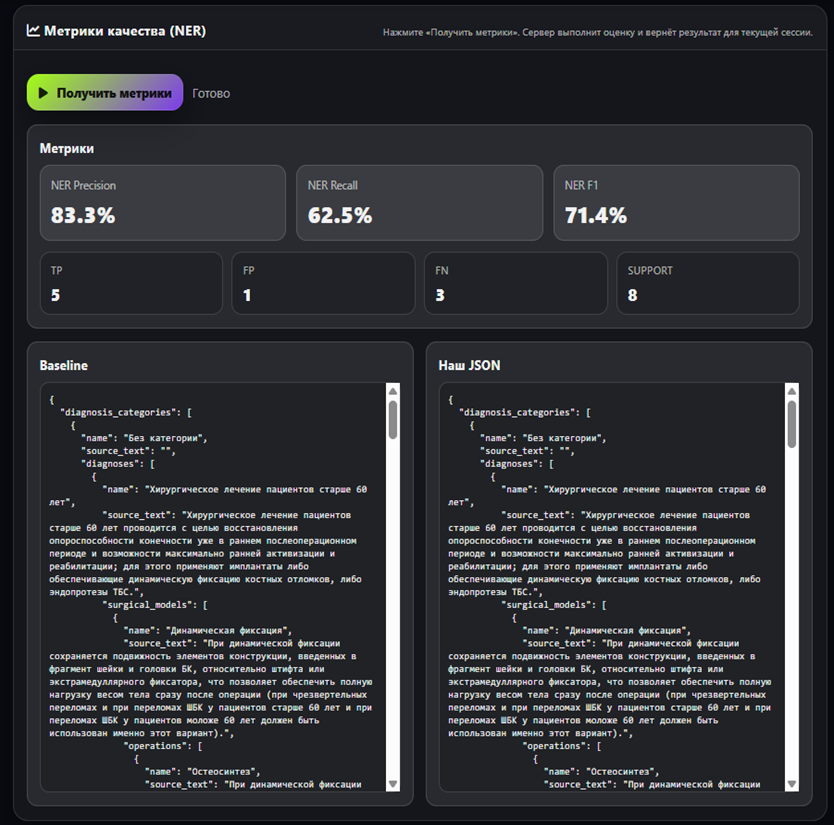

_Рисунок 6 – Метрики качества_

Для просмотра загрузки новой клинической рекомендации в систему и формирование графа знаний на его основе необходимо перейти на главную страницу системы и выбрать пункт «Добавить клиническую рекомендацию». В появившемся окне – ввести название рекомендации, которое будет показано пользователю, системное имя рекомендации, а также – сам файл клинической рекомендации (рисунок 7).

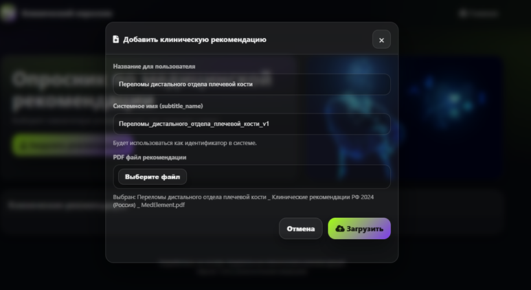

_Рисунок 7 – Окно добавление клинической рекомендации_

Следует обратить внимание на то, что загружаемый документ должен быть в формате PDF и включать страницы только из раздела «Хирургическое лечение» в клинической рекомендации (рисунок 8, 9).

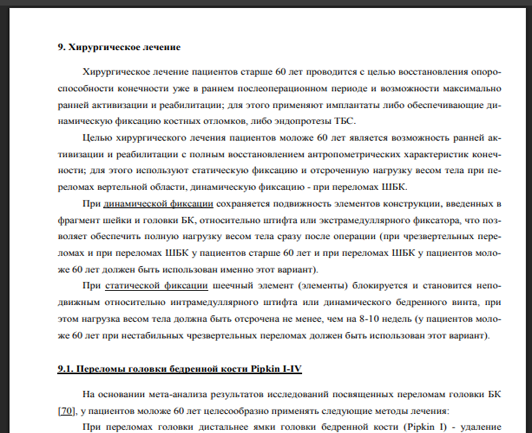

_Рисунок 8 –Пример первой страницы загружаемого документа_

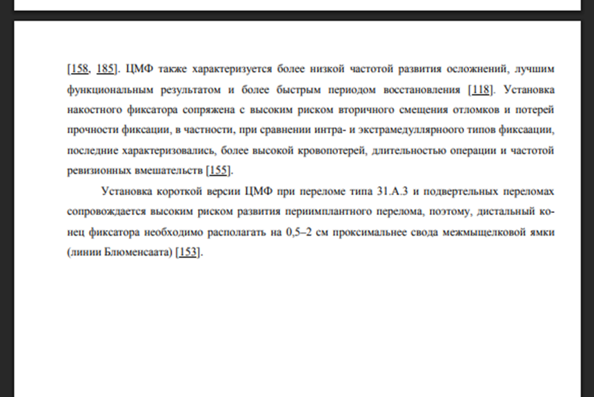

_Рисунок 9 – Пример последней страницы загружаемого документа_

После окончания загрузки документа отобразится сообщение об успешном добавлении, новая клиническая рекомендация отобразится в списке клинических рекомендаций.


_Рисунок 10 – Пункт «Рекомендация успешно добавлена»_
