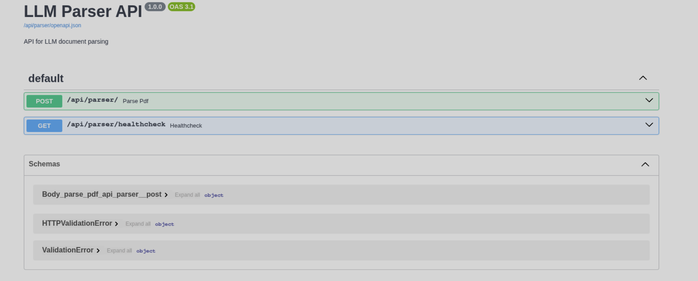
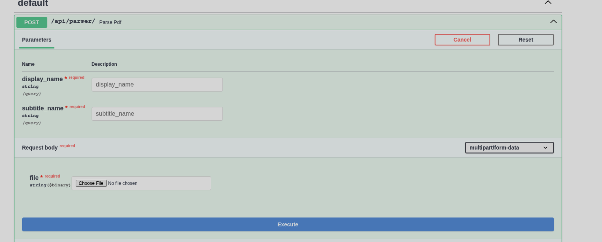
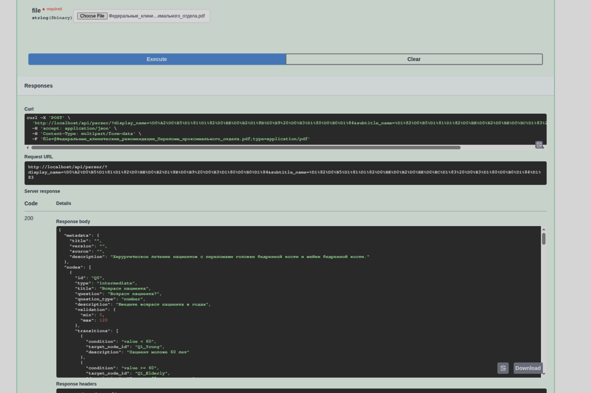
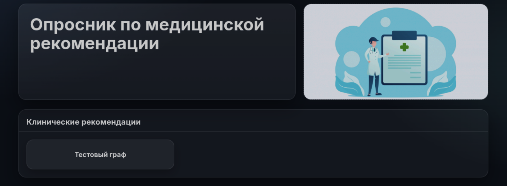
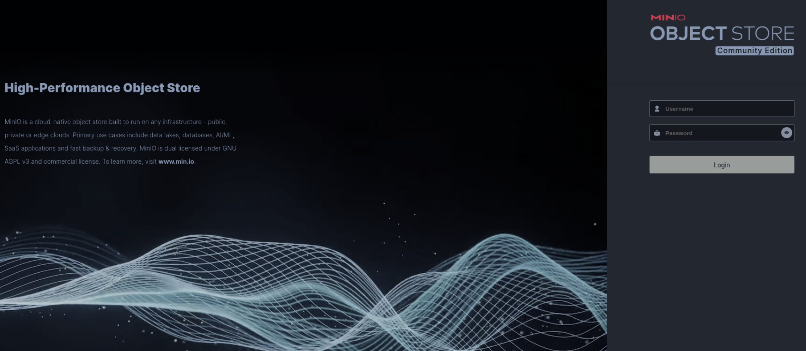
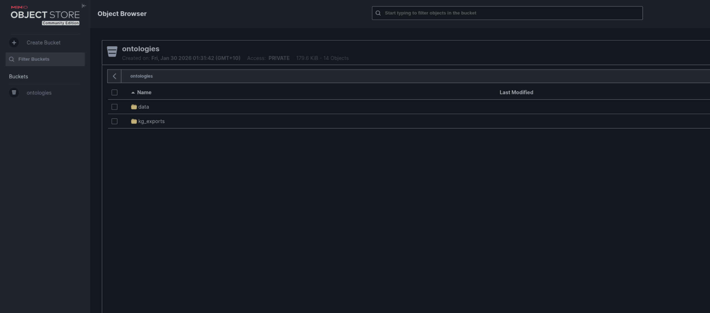
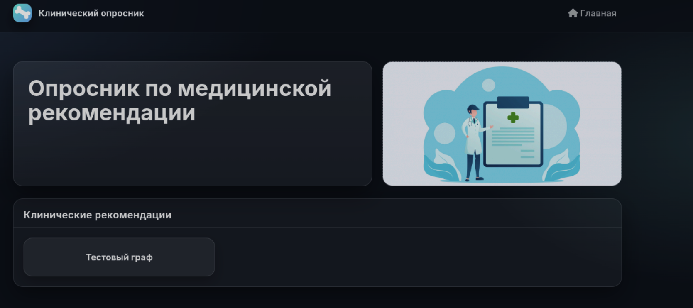
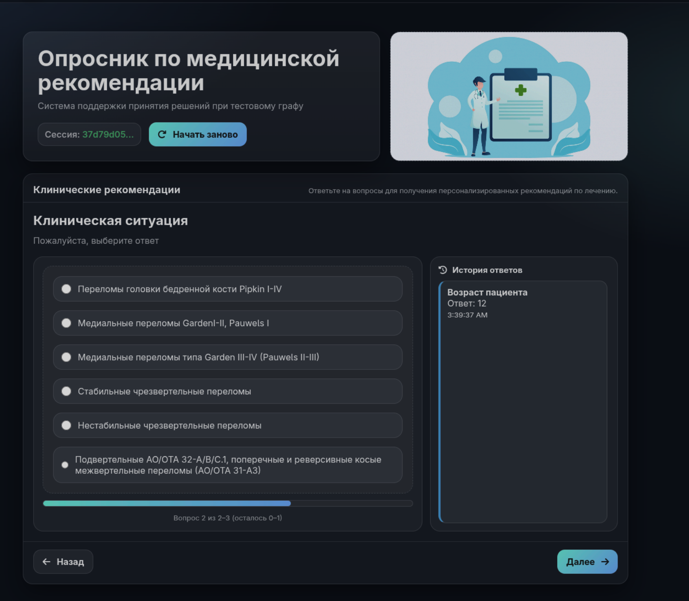
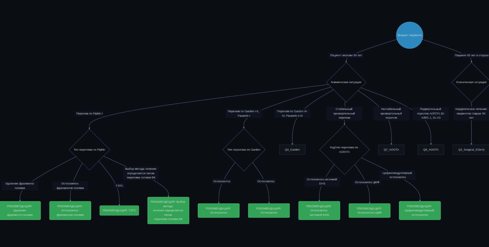

# Propositum-Fungorum
Интеллектуальная система, позволяющая проводить опрос, связанный с выбором хирургического лечения, на основе графовой модели принятия решений. Сами графы знаний извлекаются автоматически посредством использования LLM и имплементирования метода каскадных промптов.

## Установка и сборка
1. Необходимо склонировать репозиторий
```sh
# SSH
git clone git@github.com:nibbartemka/Propositum-Fungorum.git
# HTTPS
git clone https://github.com/nibbartemka/Propositum-Fungorum.git
```

2. Перейти в директорию проекта
```sh
cd ./Propositum-Fungorum
```

3. В корне проекта сформировать `.env` файл на основе `.env.example` 
```sh
cp .env.example .env
```

4. Подставить необходимые значения в ранее описанные `.env` вместо `***`
```sh
# MinIO root credentials (только для инициализации)
MINIO_ROOT_USER=***
MINIO_ROOT_PASSWORD=***

MINIO_APP_USER=***
MINIO_APP_PASSWORD=***

YANDEX_AUTH_TOKEN=***
YANDEX_MODEL_PACKAGE=***
```

Убедитесь, что у вас установлен и работает Docker
```sh
# Ссылка на скачивание Docker
https://www.docker.com/products/docker-desktop/
```
5. Находясь в корневой директории необходимо развернуть проект:
```sh
docker compose up -d --build
```

* Проект будет доступен на http://localhost/

* Загрузка своих клинических рекомендаций будет доступна на http://localhost/api/parser/docs

## 

## Формирование графа клинической рекомендации

1. Открыть http://localhost/api/parser/docs



2. Раскрыть ручку /api/parser и загрузить файл, заполнить поля и нажать на execute

   * display_name - название, которое будет отображаться в меню выборов графов
   * subtitle_name - название, которое будет отображаться в окне опросника по графу
   * file - загружаемый файл



3. Полученный ответ является представлением графа. Сам граф будет автоматически загруэен в хранилище файлов по ссылке 
http://localhost/console/browser/ontologies/data%2F и будет доступен в меню выбора графов.





## Просмотр хранилища графов

1. Открыть http://localhost/console

2. Ввесть логин и пароль (прописаны в .env файле)





3. Открыть директорию data

4. Все файлы с uuid - полученые графы. Файл metadata.json описывает метаданные файла графов. Создан для отображения графов на главной странице. Есть возможность врущную загружать графы, но для этого их нужно прописать в metadata.json.
Основная структура файла:
```json
[
  {
    "id": "29a91e7f-2413-4798-8d58-469082e70e90", // Идентификатор графа, любой uuid
    "value": 0, // Индекс графа
    "display_name": "Тестовый граф", // Название для отображения
    "subtitle_name": "тестовому графу", // Название для отображения в окне опросника
    "questionnaire_path": "/data/a421a5b5-4d1c-491d-8958-62911dd0a576.json" // Путь до файла в s3 хранилище
  }
]
```

**Внимание!** Удаление файла metadata.json не только удаляет список графов на странице выбора, но и ломает запуск сервисов.

## Выбор диагноза

1. Открыть http://localhost



2. Выбрать диагноз и нажать на кнопку "Начать опросник"



* Начать заного - начать опрос пациента с самого начала графа

* Главная - вернуться в меню выбора графов

* Схема лечения - визуализация графа


